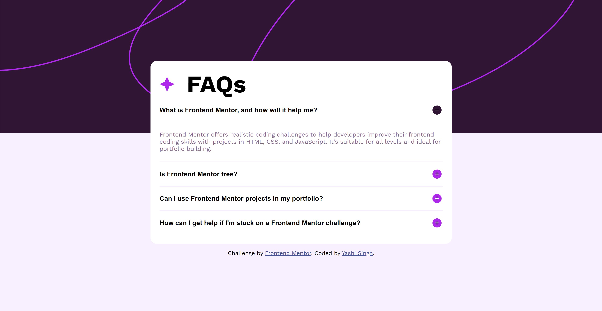
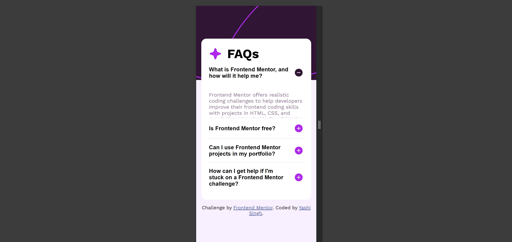

# Frontend Mentor - FAQ Accordion Solution

This is a solution to the [FAQ accordion challenge on Frontend Mentor](https://www.frontendmentor.io/challenges/faq-accordion-wyfFdeBwBz). Frontend Mentor challenges help you improve your coding skills by building realistic projects.

 

## Table of Contents

- [Overview](#overview)
  - [The Challenge](#the-challenge)
  - [Screenshot](#screenshot)
  - [Links](#links)
- [My Process](#my-process)
  - [Built with](#built-with)
  - [What I Learned](#what-i-learned)
  - [Continued Development](#continued-development)
  - [Useful Resources](#useful-resources)
- [Author](#author)
- [Acknowledgments](#acknowledgments)

## Overview

### The Challenge

Users should be able to:

- Hide/Show the answer to a question when the question is clicked.
- Navigate the questions and hide/show answers using keyboard navigation alone.
- View the optimal layout for the interface depending on their device's screen size.
- See hover states for all interactive elements on the page.

### Screenshot

### Links

- Solution URL: [Frontend Mentor](https://www.frontendmentor.io/solutions/faq-accordion-oOrUhD8eU3)
- Live Site URL: [Live](https://faq-accordion-solution-by-yashi.netlify.app/)

## My Process

### Built with

- Semantic HTML5 markup
- CSS custom properties
- Flexbox
- CSS Grid
- Mobile-first workflow
- Vanilla JavaScript for interactive functionality
- [Google Fonts](https://fonts.google.com/) - For font styling

### What I Learned

During this project, I focused on creating an accessible and user-friendly FAQ accordion. Key learnings include:

- Implementing JavaScript to manage accordion state while ensuring accessibility.
- Using CSS transitions to smoothly animate accordion content.
- Ensuring semantic HTML5 structure and ARIA roles for accessibility.

### Continued Development

For future projects, I aim to:

- Enhance my understanding of advanced CSS techniques and animations.
- Explore more accessibility features and best practices.
- Continue refining JavaScript for better performance and usability.

### Useful Resources

- [MDN Web Docs - ARIA](https://developer.mozilla.org/en-US/docs/Web/Accessibility/ARIA) - Valuable for understanding accessibility roles and properties.
- [CSS Tricks - Flexbox](https://css-tricks.com/snippets/css/a-guide-to-flexbox/) - A comprehensive guide to using Flexbox effectively.

## Author

- Frontend Mentor - [@Yashi-Singh-1](https://www.frontendmentor.io/profile/Yashi-Singh-1)
- GitLab - [Yashi-Singh-9](https://gitlab.com/Yashi-Singh-9)
- LinkedIn - [Yashi Singh](https://www.linkedin.com/in/yashi-singh-b4143a246)

## Acknowledgments

Thank you to the Frontend Mentor community for providing such engaging challenges. Special thanks to those who offered guidance and feedback throughout the project.
